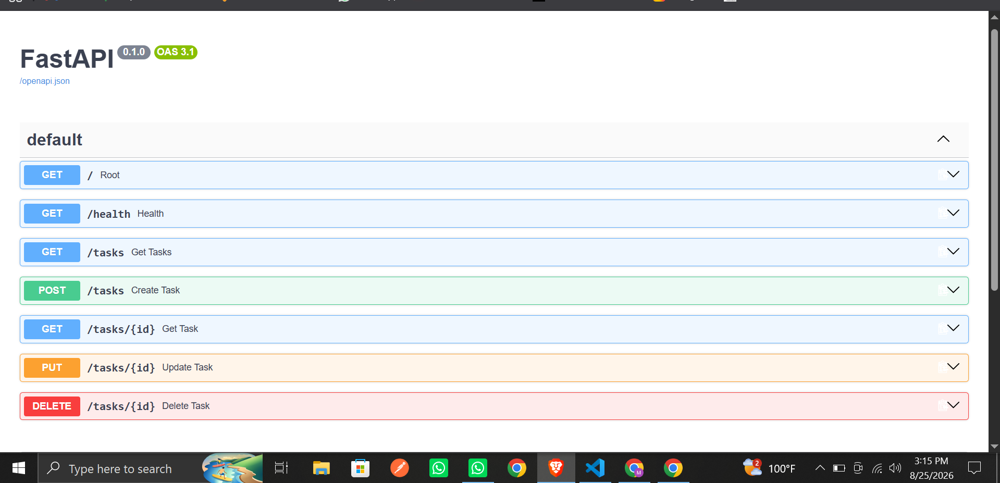

# Task API — FlyRank CRUD FastAPI

A small, beginner-friendly **To-Do List REST API** built with **FastAPI**.
It demonstrates a complete **CRUD** (Create, Read, Update, Delete) workflow
using an **in-memory** Python list as the data store — no database required.

---

## Project Description

This project is a simple Task Management API that lets you create, view,
update, and delete tasks over HTTP. It is designed as a learning project
to understand how FastAPI works with:

- Path and query parameters
- Request and response bodies
- Pydantic data validation
- HTTP status codes (`200`, `201`, `204`, `400`, `404`)
- Auto-generated interactive API documentation (Swagger UI)

The data is stored in a **Python list in memory**, so it resets every time
the server restarts. This keeps the project simple and focused on the API
layer.

---

## Features

- Create a new task
- Get all tasks
- Get a single task by ID
- Update a task's title and/or `done` status
- Delete a task by ID
- Automatic generation of unique task IDs
- `done` defaults to `false` when a task is created
- Returns **404** when a task does not exist
- Returns **400** when the title is empty or only whitespace
- Auto-generated Swagger UI and OpenAPI schema
- CORS-free, database-free, authentication-free — pure FastAPI

---

## Technologies Used

| Technology  | Purpose                                      |
| ----------- | -------------------------------------------- |
| Python      | Programming language                         |
| FastAPI     | Web framework for building the API           |
| Uvicorn     | ASGI server used to run the FastAPI app      |
| Pydantic    | Request/response data validation             |

---

## Project Structure

```
Curd Fastapis/
├── main.py            # FastAPI application and all endpoints
├── requirements.txt   # Python dependencies
├── README.md          # Project documentation
├── .gitignore         # Files/folders excluded from Git
├── Swagger.png        # Screenshot of the Swagger UI
└── env/               # Local virtual environment (NOT uploaded to GitHub)
```

> The `env/` folder and `__pycache__/` are listed in `.gitignore`, so they
> are **never** pushed to GitHub.

---

## Requirements

- **Python 3.9+** (recommended: 3.10 or newer)
- **pip** (Python package manager)
- A terminal (PowerShell, Command Prompt, or bash)

---

## Installation

### 1. Clone the repository

```bash
git clone https://github.com/<your-username>/<your-repo-name>.git
cd "Curd Fastapis"
```

### 2. Create a virtual environment

```bash
python -m venv env
```

### 3. Activate the virtual environment

**Windows (PowerShell):**

```bash
.\env\Scripts\Activate.ps1
```

**Windows (Command Prompt):**

```bash
env\Scripts\activate.bat
```

**macOS / Linux:**

```bash
source env/bin/activate
```

---

## Installing Dependencies

All required packages are listed in `requirements.txt`. Install them with:

```bash
pip install -r requirements.txt
```

This will install:

- `fastapi`
- `uvicorn`
- `pydantic`
- and their supporting packages

---

## How to Run the Server

From the project root (with the virtual environment activated), run:

```bash
uvicorn main:app --reload
```

You should see output similar to:

```
INFO:     Uvicorn running on http://127.0.0.1:8000 (Press CTRL+C to quit)
INFO:     Started reloader process
INFO:     Started server process
INFO:     Application startup complete.
```

The `--reload` flag enables auto-reload on code changes (development only).

---

## API Base URL

```
http://127.0.0.1:8000
```

---

## Swagger UI (Interactive Documentation)

FastAPI automatically generates an interactive API documentation page:

```
http://127.0.0.1:8000/docs
```

From Swagger UI you can:

- View every endpoint
- See request and response schemas
- Try out requests directly from the browser

---

## OpenAPI JSON Schema

The raw OpenAPI specification is available at:

```
http://127.0.0.1:8000/openapi.json
```

This is useful for generating client libraries or importing into tools like Postman.

---

## API Endpoints

| Method | Endpoint        | Description                              | Success Status |
| ------ | --------------- | ---------------------------------------- | -------------- |
| GET    | `/`             | API info and available endpoints         | `200 OK`       |
| GET    | `/health`       | Health check                             | `200 OK`       |
| GET    | `/tasks`        | Get the list of all tasks                | `200 OK`       |
| GET    | `/tasks/{id}`   | Get a single task by ID                  | `200 OK`       |
| POST   | `/tasks`        | Create a new task                        | `201 Created`  |
| PUT    | `/tasks/{id}`   | Update a task's title and/or `done`      | `200 OK`       |
| DELETE | `/tasks/{id}`   | Delete a task by ID                      | `204 No Content` |

### Task Object Schema

```json
{
  "id": 1,
  "title": "Learn FastAPI",
  "done": false
}
```

| Field  | Type    | Required | Description                                  |
| ------ | ------- | -------- | -------------------------------------------- |
| `id`   | integer | auto     | Auto-generated unique task ID                |
| `title`| string  | yes      | Task title (must not be empty)               |
| `done` | boolean | no       | Completion status, defaults to `false`       |

---

## Example Requests and Responses

### 1. Root — `GET /`

**Response `200 OK`:**

```json
{
  "name": "Task API",
  "version": "1.0",
  "endpoints": ["/tasks"]
}
```

---

### 2. Health Check — `GET /health`

**Response `200 OK`:**

```json
{
  "status": "ok"
}
```

---

### 3. Get All Tasks — `GET /tasks`

**Response `200 OK`:**

```json
[
  { "id": 1, "title": "Learn FastAPI", "done": false },
  { "id": 2, "title": "Build CRUD API", "done": false },
  { "id": 3, "title": "Push project to GitHub", "done": false }
]
```

---

### 4. Get a Single Task — `GET /tasks/{id}`

**Response `200 OK`:**

```json
{
  "id": 1,
  "title": "Learn FastAPI",
  "done": false
}
```

---

### 5. Create a Task — `POST /tasks`

**Request body:**

```json
{
  "title": "Write project README"
}
```

**Response `201 Created`:**

```json
{
  "id": 4,
  "title": "Write project README",
  "done": false
}
```

> The `id` is generated automatically, and `done` defaults to `false`.

---

### 6. Update a Task — `PUT /tasks/{id}`

You can update the `title`, the `done` flag, or both. Any field you omit
is left unchanged.

**Request body (update both fields):**

```json
{
  "title": "Write project README (updated)",
  "done": true
}
```

**Response `200 OK`:**

```json
{
  "id": 4,
  "title": "Write project README (updated)",
  "done": true
}
```

**Request body (only mark as done):**

```json
{
  "done": true
}
```

**Request body (only rename):**

```json
{
  "title": "New title here"
}
```

---

### 7. Delete a Task — `DELETE /tasks/{id}`

**Response `204 No Content`** (empty body)

---

## curl Examples

The following commands test each CRUD endpoint from the terminal.

### GET all tasks

```bash
curl -i http://127.0.0.1:8000/tasks
```

### GET a single task

```bash
curl -i http://127.0.0.1:8000/tasks/1
```

### POST — create a new task

```bash
curl -i -X POST http://127.0.0.1:8000/tasks \
  -H "Content-Type: application/json" \
  -d "{\"title\": \"Write project README\"}"
```

### PUT — update a task

```bash
curl -i -X PUT http://127.0.0.1:8000/tasks/1 \
  -H "Content-Type: application/json" \
  -d "{\"title\": \"Learn FastAPI (done)\", \"done\": true}"
```

### DELETE — remove a task

```bash
curl -i -X DELETE http://127.0.0.1:8000/tasks/1
```

---

## Error Responses

### 404 — Task Not Found

Returned when you try to read, update, or delete a task ID that does not exist.

```bash
curl -i http://127.0.0.1:8000/tasks/999
```

**Response `404 Not Found`:**

```json
{
  "detail": "Task 999 not found"
}
```

The same `404` response is also returned for:

- `PUT /tasks/999` — task does not exist
- `DELETE /tasks/999` — task does not exist

---

### 400 — Validation Error (Empty Title)

The API rejects empty or whitespace-only titles.

**POST with an empty title:**

```bash
curl -i -X POST http://127.0.0.1:8000/tasks \
  -H "Content-Type: application/json" \
  -d "{\"title\": \"\"}"
```

**Response `400 Bad Request`** (from Pydantic validation):

```json
{
  "detail": [
    {
      "type": "string_too_short",
      "loc": ["body", "title"],
      "msg": "String should have at least 1 character",
      "input": "",
      "ctx": { "min_length": 1 }
    }
  ]
}
```

**PUT with an empty/whitespace title:**

```bash
curl -i -X PUT http://127.0.0.1:8000/tasks/1 \
  -H "Content-Type: application/json" \
  -d "{\"title\": \"   \"}"
```

**Response `400 Bad Request`:**

```json
{
  "detail": "Title cannot be empty"
}
```

---

## Data Storage Notice

This API uses a **plain Python list (`tasks`)** stored in memory as its
temporary data store. There is **no database**.

Because of this:

- All data is **lost when the server stops or restarts**.
- Restarting with `uvicorn main:app --reload` after a code change keeps
  data only if no Python process is killed; in practice, treat the data
  as ephemeral.
- This is intentional — the project focuses on the API layer, not persistence.

---

## Swagger UI Screenshot

Below is a screenshot of the interactive Swagger UI for this API
(available at `http://127.0.0.1:8000/docs`):




---

## GitHub

This project is intended to be pushed to GitHub. The `.gitignore` file
ensures that the following are **not** uploaded:

- `env/` — your local virtual environment
- `__pycache__/` — Python cache folders
- `*.pyc` — compiled Python files
- `.vscode/` — editor settings (optional)

Before pushing, verify:

```bash
git status
```

You should **not** see `env/` or `__pycache__/` listed as untracked files.

---

## How Another Developer Can Clone and Run This Project

```bash
# 1. Clone the repository
git clone https://github.com/<your-username>/<your-repo-name>.git

# 2. Enter the project folder
cd "Curd Fastapis"

# 3. Create a virtual environment
python -m venv env

# 4. Activate the virtual environment
#    Windows PowerShell:
.\env\Scripts\Activate.ps1
#    macOS / Linux:
# source env/bin/activate

# 5. Install dependencies
pip install -r requirements.txt

# 6. Run the server
uvicorn main:app --reload
```

Open `http://127.0.0.1:8000/docs` in a browser to explore the API.

---

## Testing

You can test the API in any of the following ways:

### 1. Swagger UI (recommended for beginners)

Visit `http://127.0.0.1:8000/docs` and use the **Try it out** button on each endpoint.

### 2. curl (terminal)

Use the curl examples shown earlier in this README.

### 3. Postman or Insomnia

Import the OpenAPI schema from `http://127.0.0.1:8000/openapi.json`
or create requests manually against the base URL `http://127.0.0.1:8000`.

### 4. Python `requests` (quick script)

```python
import requests

BASE = "http://127.0.0.1:8000"

# Create a task
r = requests.post(f"{BASE}/tasks", json={"title": "Test from Python"})
print(r.status_code, r.json())

# Get all tasks
print(requests.get(f"{BASE}/tasks").json())
```

---

## Learning Outcomes / What Was Implemented

By building and studying this project, you will learn how to:

- Set up a **FastAPI** project from scratch
- Define **GET, POST, PUT, DELETE** endpoints
- Use **Pydantic models** (`BaseModel`, `Field`) for input validation
- Use `Field(min_length=1)` to enforce non-empty string fields
- Use `Optional` fields with `None` defaults for partial updates (`PUT`)
- Raise `HTTPException` for `404 Not Found` and `400 Bad Request` errors
- Return proper HTTP status codes (`200`, `201`, `204`)
- Auto-generate **Swagger UI** and **OpenAPI** documentation
- Run an ASGI application with **Uvicorn** and the `--reload` flag
- Manage dependencies using `requirements.txt`
- Exclude local environment folders using `.gitignore`
- Use `curl -i` to inspect HTTP response headers and bodies

---

## Author

Built as a learning project for the **FlyRank** Python / FastAPI track.
